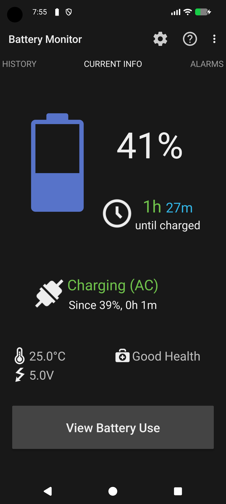
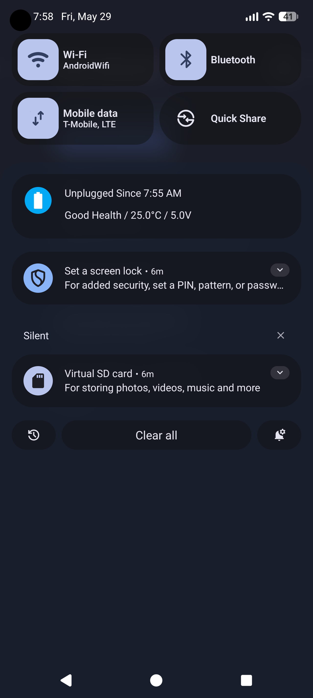
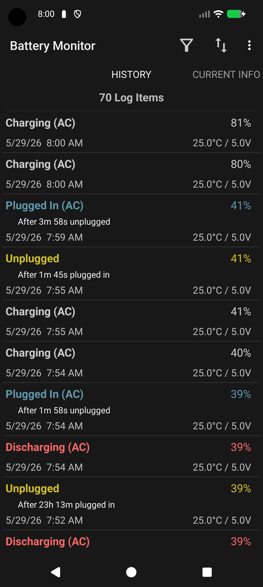
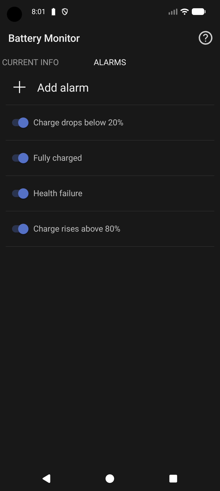

<p align="center">
  
</p>

<h1 align="center">Battery Monitor</h1>

<div align="center">
  
[](https://github.com/tswistak/Battery-Monitor/releases/latest)
[](https://f-droid.org/packages/codes.swistak.batterymonitor/)

</div>

Battery Monitor is a classic, no-nonsense Android battery app focused on clarity, reliability, and control.

See battery status at a glance, get meaningful notifications, and track battery behavior over time.

<p align="center">
  
  
  
  
</p>

## Highlights

- Live battery percentage and status in notifications
- Detailed current battery info (charge, temperature, voltage, health, plug state)
- Access advanced battery info using root or Shizuku
- Configurable battery alarms (for charge levels, temperature, and more)
- Battery history/logging with CSV export
- Home screen widgets
- Privacy-friendly by design (no personal data collection)

## Features

### Main Notification
- Persistent battery status in the notification area
- Flexible display options for percentage/time/status content
- Designed for quick readability

### Battery Alarms
- Alerts for full charge
- Alerts when charge drops below or rises above selected levels
- Optional temperature and health-related alerts

### History and Logs
- Built-in battery event logging
- Filter and review battery events
- Export logs to CSV for analysis

### Widgets
- Circle and full-size widget variants
- Keep battery info visible without opening the app

## Privacy

Battery Monitor processes battery and device information locally, including values exposed by the device such as a battery serial number. It does not transmit this information or collect it on external servers.

## Project Background

This project is a fork of [Battery Indicator Pro / BatteryBot Pro](https://github.com/darshan-/Battery-Indicator-Pro), with continued development and rebranding.

The main goal of the fork is to maintain and enhance the app to ensure it works well on modern Android versions. Check [CHANGELOG](CHANGELOG.md) for details on changes and updates.

Huge thanks to the original authors and contributors.

## Build

Build with Android Studio or from CLI:

```bash
./gradlew assembleDebug
```

## License

GNU GPL v3.0-or-later.  
See [LICENSE](LICENSE).
